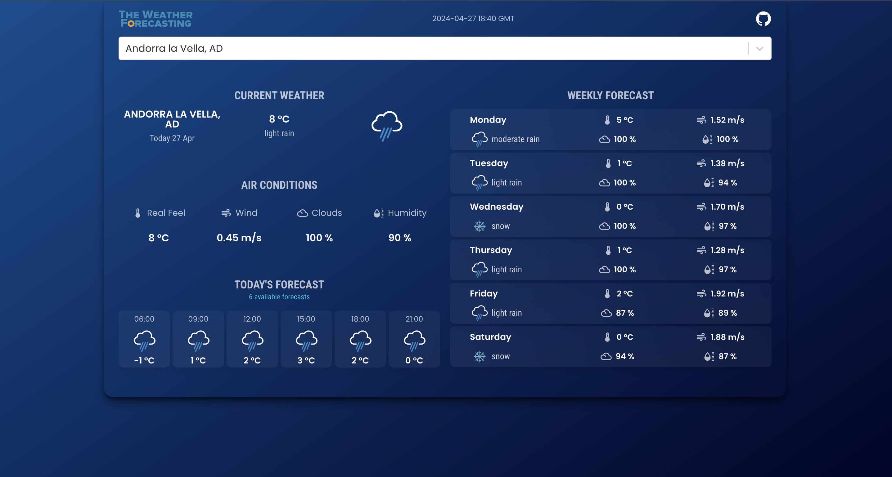

 
 

With [The Weather Forecasting](https://sky-savvy.vercel.app) user can search locations by city name and observe the weather for the next 5-6 days and 3 hour interval.
 
The app is developed using React.js and material-UI.

 

## 💻 Live Demo:

https://sky-savvy.vercel.app

 

## ✨ Getting Started

- Make sure you already have `Node.js` and `npm` installed in your system.
- You need an API key from [OpenWeatherMap](https://openweathermap.org/). After creating an account, [grab your key](https://home.openweathermap.org/api_keys).
  - **`api/OpenWeatherService.js`**: It contains the code related to the back-end of the application.

 

## ⚡ Install

- Clone the repository:

- Install the packages using the command `npm install`

 

## 📙 Used libraries

- `react-js`
- `material-ui`

Check `packages.json` for details

 
 
Thank You ☺
